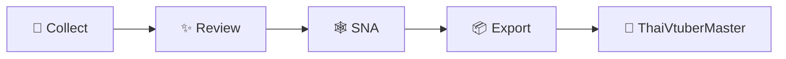

<div align="center">

# ✦ ThaiVtuberSNA ✦

### Audience Network & Data Worker for the Thai VTuber ecosystem

*collect • review • connect • export*  
(ﾉ◕ヮ◕)ﾉ*:･ﾟ✧

[](https://www.python.org/)
[](https://duckdb.org/)
[](https://github.com/Icezaza2543/ThaiVtuberSNA/actions)
[](https://github.com/Icezaza2543/ThaiVtuberMaster)

<br>

**ThaiVtuberSNA** is the backend data engine behind  
[**ThaiVtuberMaster**](https://github.com/Icezaza2543/ThaiVtuberMaster).

It discovers public creator accounts, reviews first-party evidence,  
builds audience-overlap networks, and exports clean datasets for the master project.

</div>

---

## ✧ How it flows



> **Public data in → reviewed identities → audience graph → clean exports.**

---

## 🌙 What lives here?

| ✦ | Module | Purpose |
|---|---|---|
| 🔎 | **Collect** | Discover creator accounts and audience interactions |
| ✨ | **Review** | Keep identity links backed by first-party evidence |
| 🕸️ | **SNA** | Calculate audience overlap with DuckDB |
| 📦 | **Export** | Produce clean datasets for ThaiVtuberMaster |
| 🛠️ | **Worker** | Run the pipeline continuously with checkpoints and backoff |

---

## 💫 Core philosophy

- **Public personas, not private people**
- **Evidence before identity linking**
- **No automatic persona merging**
- **Privacy-preserving audience hashes**
- **Reproducible, idempotent data processing**
- **ThaiVtuberMaster stays the public-facing home**

---

## 🪄 Quick start

```bash
pip install -r requirements.txt

python migrate.py
python -m thaivtubersna validate
python -m thaivtubersna run
```

Run continuously:

```bash
python -m thaivtubersna worker
```

Run tests:

```bash
python -m pytest tests/ -v
```

---

## 📦 Exports

The pipeline produces five main datasets:

```text
VTUBERS.csv
NETWORK_RESULT.csv
TIKTOK_VERIFIED.csv
TWITCH_VERIFIED.csv
ANALYTICS_METRICS.csv
```

---

<div align="center">

### ✦ Data engine here. Experience there. ✦

[**Explore ThaiVtuberMaster →**](https://github.com/Icezaza2543/ThaiVtuberMaster)

<br>

*Built for a cleaner, more traceable view of the Thai VTuber ecosystem.*

**₊˚⊹♡  ThaiVtuberSNA  ♡⊹˚₊**

</div>
