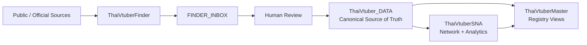

<div align="center">

# ✦ ThaiVtuberSNA ✦

### Network & Analytics Engine for the Thai VTuber ecosystem

*observe • connect • analyze • export*

[](https://www.python.org/)
[](https://duckdb.org/)
[](https://github.com/Icezaza2543/ThaiVtuberSNA/actions)
[](https://github.com/Icezaza2543/ThaiVtuberMaster)

<br>

**ThaiVtuberSNA** is the downstream network and analytics engine of the Thai VTuber data stack.

Canonical identity state lives in **ThaiVtuber_DATA**. New public-account discovery and
candidate enrichment live in [**ThaiVtuberFinder**](https://github.com/Icezaza2543/ThaiVtuberFinder).
SNA consumes reviewed identities, processes audience/network observations, and exports
derived datasets for [**ThaiVtuberMaster**](https://github.com/Icezaza2543/ThaiVtuberMaster).

</div>

---

## ✧ System architecture



> **Finder discovers. Humans review. ThaiVtuber_DATA decides. SNA analyzes. Master presents.**

| Component | Responsibility |
|---|---|
| [ThaiVtuberFinder](https://github.com/Icezaza2543/ThaiVtuberFinder) | Discover/enrich public accounts and submit review candidates |
| **ThaiVtuber_DATA** | Canonical personas, accounts, account links, organizations, affiliations, lifecycle state, reviewed decisions |
| **ThaiVtuberSNA** | Audience/network observations, graph computation, derived metrics, reproducible exports |
| [ThaiVtuberMaster](https://github.com/Icezaza2543/ThaiVtuberMaster) | Public-facing registry and analytics explorer |

---

## 🌙 What belongs here?

| Module | Responsibility |
|---|---|
| **Canonical input** | Consume reviewed persona/account/link state from ThaiVtuber_DATA or a validated canonical snapshot |
| **Observation collection** | Gather analytical/audience observations for already-known reviewed identities |
| **SNA** | Calculate audience overlap and network-derived metrics |
| **Analytics** | Produce dated, reproducible derived datasets |
| **Export** | Deliver clean datasets to ThaiVtuberMaster and research workflows |
| **Worker** | Run analytical pipelines continuously with checkpoints/backoff where applicable |

New creator discovery and candidate review intake should go to **ThaiVtuberFinder**, not be
implemented as a second discovery system here.

Legacy discovery/reconciliation scripts may remain for reproducibility and migration history,
but they are not the authoritative path for new canonical identities.

---

## 💫 Shared identity and evidence rules

- **ThaiVtuber_DATA is the source of truth.**
- Public personas/accounts are modeled separately from private people.
- Identity links require reviewed evidence.
- No automatic persona merging from name, voice, artwork, handle similarity, or presumed operator.
- New persona/model/re-debut records remain separate until a reviewed canonical decision says otherwise.
- Organization/group accounts remain separate from individual personas.
- Audience data (commenter IDs and display names) stays in local private storage — never in shared sheets or the repo. Comment text is not collected.
- Analytical observations do not silently rewrite canonical persona/account ownership.
- Processing is reproducible and idempotent where possible.

---

## 🪄 Quick start

```bash
pip install -r requirements.txt

python migrate.py
python -m thaivtubersna validate
python -m thaivtubersna run
```

Continuous worker:

```bash
python -m thaivtubersna worker
```

Tests:

```bash
python -m pytest tests/ -v
```

---

## 💬 YouTube comment census + daily channel metrics

One free-tier worker (`collector/yt_comment_census.py`) collects, for every verified
YouTube channel in ThaiVtuber_DATA:

- **Comments 2021–2026**, newest year first. Stored per comment/reply: comment id, video,
  channel, commenter channel id, commenter display name, time, likes, parent id.
  **Comment text is never requested or stored.**
- **Shorts are skipped** (owner decision: the SNA models loyal viewers, not drive-by
  Shorts traffic). Durations come from `videos.list`; videos ≤3 min are confirmed via
  the `/shorts/<id>` URL.
- **Daily metrics** (title, subscribers, views, video count) for every channel,
  ~45 units/day. Full history stays local; the sheet gets the latest value per channel
  (`ANALYTICS_METRICS`) and 7/30/90-day deltas (`ANALYTICS_GROWTH`).

It uses one `YOUTUBE_API_KEY` (from `.env`), stays under the free 10,000-unit daily
quota, checkpoints every page, and sleeps over the Pacific-midnight reset.

```bash
python -m collector.yt_comment_census channels   # refresh channel list from ThaiVtuber_DATA
python -m collector.yt_comment_census run        # run continuously
python -m collector.yt_comment_census status     # progress (works while the worker runs)
```

On the owner's PC it runs as the Windows scheduled task **"ThaiVtuberSNA YT Comment
Census"** (starts at logon). Pause with `Disable-ScheduledTask "ThaiVtuberSNA YT Comment Census"`.

### Local private data (outside the repo)

| File (`%LOCALAPPDATA%\ThaiVtuberSNA\`) | Contents |
|---|---|
| `yt_comments.duckdb` | census: channels, videos, comments, reply jobs, quota, channel_metrics |
| `yt_comments_status.txt` / `yt_comments.log` | worker status snapshot and log |
| `sna_archive.duckdb` | verified snapshot of all 19 former ThaiVtuber_SNA tabs, incl. the old viewer tables (`PRIVATE_DATA_ARCHIVE`, `VIEWER_*`, `ALL_COMMENTERS`) |

`sna_archive.duckdb` is the only copy of the legacy viewer data — keep a private backup.
`storage/local_archive_store.py` reads it with the same interface as the old sheet store.

---

## 🗂️ Canonical-data scripts (ThaiVtuber_DATA)

All are dry-run unless `--write`, append/update only, and idempotent.

| Script | Purpose |
|---|---|
| `scripts/import_vtuberthaiinfo_base.py` | VtuberThaiInfo talents → personas/accounts/links (trusted base) |
| `scripts/import_vtuberthaiinfo_affiliations.py` | VtuberThaiInfo memberships → organizations/affiliations |
| `scripts/import_easydonate_links.py <file>` | reviewed EasyDonate research files → accounts/links/personas |
| `scripts/apply_persona_renames.py <file>` / `fix_slug_persona_names.py` | guarded display-name fixes |
| `scripts/sync_canonical_to_sna_sheet.py [--update-names]` | append newly verified accounts to ThaiVtuber_SNA for Master |
| `scripts/archive_sna_sheet.py [--verify]` / `clean_sna_sheet.py` | snapshot and clean the ThaiVtuber_SNA sheet |

## 📑 ThaiVtuber_SNA sheet (read by ThaiVtuberMaster)

`VTUBERS` (verified channels only), `VTUBERS_RETIRED`, `NETWORK_RESULT`, `TIKTOK_VERIFIED`,
`TWITCH_VERIFIED`, `ANALYTICS_METRICS`, `ANALYTICS_GROWTH`, `DATA_DICTIONARY`, `SYSTEM`.
Private/raw tabs were moved to the local archive on 2026-09-26.

---

## 📦 Derived exports

The analytical pipeline currently produces datasets such as:

```text
VTUBERS.csv
NETWORK_RESULT.csv
TIKTOK_VERIFIED.csv
TWITCH_VERIFIED.csv
ANALYTICS_METRICS.csv
```

These are downstream delivery/analysis artifacts. They do not replace ThaiVtuber_DATA as
canonical identity state.

---

## 🔄 Finder → Canonical → SNA handoff

The intended flow is:

```text
ThaiVtuberFinder
    ↓
FINDER_INBOX / relation proposals
    ↓
Human review
    ↓
ThaiVtuber_DATA
    ↓
validated canonical snapshot
    ↓
ThaiVtuberSNA
    ↓
network + analytics exports
    ↓
ThaiVtuberMaster
```

SNA must not treat an unreviewed Finder candidate as a canonical persona.

---

## 🧭 Responsibility boundary

Use this repository for:

- audience/network collection for reviewed accounts
- DuckDB/network computation
- analytical metrics and research outputs
- export preparation
- migration/reconciliation reproducibility

Do **not** use it as the primary home for:

- broad public-account discovery
- Finder inbox synchronization
- automatic cross-platform identity linking
- canonical persona promotion
- public website presentation

Those responsibilities belong to Finder, ThaiVtuber_DATA, and Master respectively.

---

## 📚 Related projects

- [ThaiVtuberFinder](https://github.com/Icezaza2543/ThaiVtuberFinder) — discovery, enrichment, provenance, review candidates
- **ThaiVtuber_DATA** — canonical source of truth
- [ThaiVtuberMaster](https://github.com/Icezaza2543/ThaiVtuberMaster) — public registry and analytics explorer

---

<div align="center">

### ✦ Finder discovers. Data decides. SNA analyzes. Master presents. ✦

*Built for a cleaner, traceable view of the Thai VTuber ecosystem.*

**₊˚⊹♡ ThaiVtuberSNA ♡⊹˚₊**

</div>
