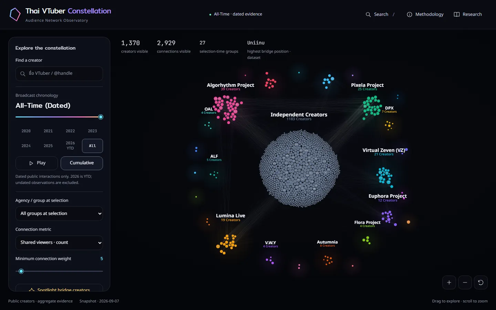
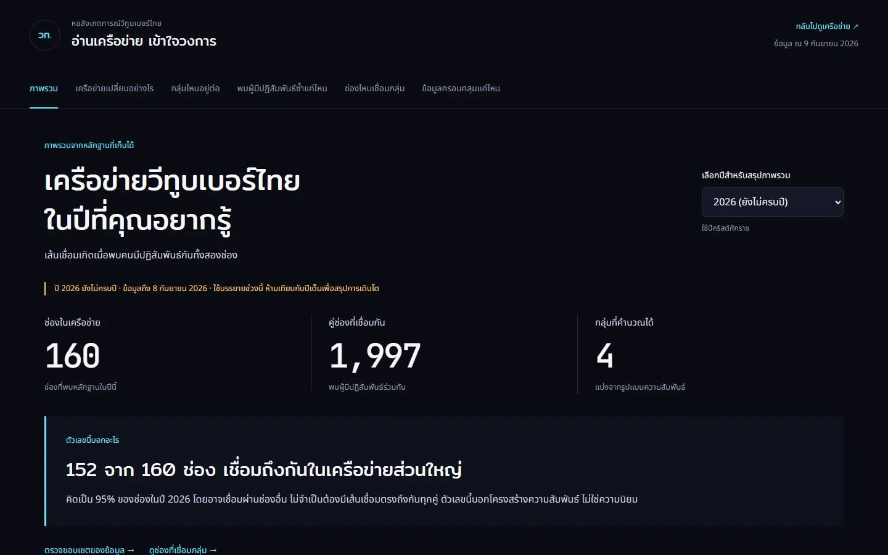
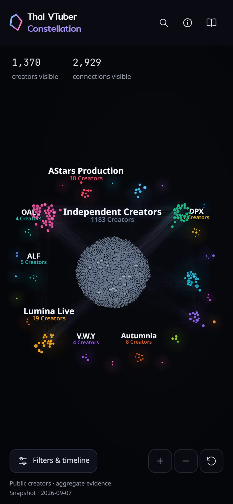
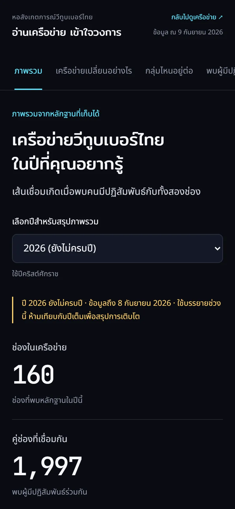
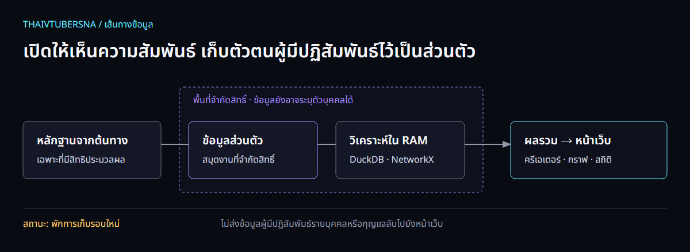

# ThaiVtuberSNA

### อ่านวงการวีทูบเบอร์ไทย ผ่านร่องรอยของคนที่มีปฏิสัมพันธ์ร่วมกัน

**Virtual Constellation Observatory · Prismatic Midnight**

[เริ่มใช้งาน](#เริ่มใช้งาน) · [อ่านกราฟให้ถูก](#อ่านกราฟให้ถูก) · [เอกสาร](#เอกสาร) · [เงื่อนไขการใช้](docs/legal/TERMS.md) · [ความเป็นส่วนตัว](docs/legal/PRIVACY.md)



ThaiVtuberSNA เป็นโครงการศึกษาความสัมพันธ์ของช่องวีทูบเบอร์ไทยบน YouTube จากความคิดเห็นและปฏิสัมพันธ์ในแชตที่มีหลักฐานอยู่ในชุดข้อมูล เปลี่ยนผลรวมเหล่านั้นเป็นเครือข่ายที่สำรวจตามเวลาได้ พร้อมหน้าวิเคราะห์ภาษาไทยสำหรับอ่านแนวโน้ม กลุ่ม และขอบเขตของหลักฐาน

**จุดหนึ่งคือช่อง เส้นหนึ่งคือความสัมพันธ์จากผู้มีปฏิสัมพันธ์ร่วมกัน — ไม่ใช่จำนวนผู้ชมทั้งหมด ความสนิท หรืออันดับความนิยม**

> **สถานะปัจจุบัน:** เปิดสำรวจ snapshot สาธารณะที่มากับ repository ได้ทันที ส่วนการเก็บข้อมูลรอบใหม่และการเผยแพร่ผ่านกระบวนการ T20 ยัง **พักอยู่** ระหว่างตรวจความพร้อม การเปิดหน้าเว็บไม่ได้เริ่มเก็บข้อมูลจาก YouTube

## สิ่งที่สำรวจได้

| มุมมอง | สิ่งที่ตอบได้ |
| --- | --- |
| **แผนที่เครือข่าย** | ช่องใดมีผู้มีปฏิสัมพันธ์ร่วมกัน ค้นหาช่อง กรองค่าย และปรับเกณฑ์เส้นเชื่อม |
| **เวลา** | สำรวจหลักฐานรวมทุกช่วงเวลา หรือแยกปีแบบรายปีและสะสม |
| **รายละเอียดช่อง** | ดูความสัมพันธ์ของช่องที่เลือกภายใต้ช่วงเวลาและตัวกรองปัจจุบัน |
| **หน้าวิเคราะห์ภาษาไทย** | จำนวนช่องและคู่ความสัมพันธ์ การต่อเนื่องของกลุ่ม บทบาทเชื่อมกลุ่ม และคุณภาพข้อมูล |
| **หลักฐานประกอบ** | ตารางตัวเลขรายกราฟ รายงานวิธีคำนวณ และผลทดสอบที่อ้างอิงได้ |



<details>
<summary>ดูหน้าจอมือถือ</summary>

<p align="center">
  
  
</p>

</details>

## เริ่มใช้งาน

การดูหน้าเว็บใช้เพียง Python สำหรับเปิด static server และเบราว์เซอร์รุ่นปัจจุบัน ไม่ต้องใช้ API key หรือเข้าถึงสมุดงานส่วนตัว

```bash
git clone https://github.com/Icezaza2543/ThaiVtuberSNA.git
cd ThaiVtuberSNA
python -m http.server 5500 --bind 127.0.0.1 --directory web
```

| หน้า | เปิดในเบราว์เซอร์ |
| --- | --- |
| เครือข่าย | <http://127.0.0.1:5500/> |
| วิเคราะห์ภาษาไทย | <http://127.0.0.1:5500/research/> |

คำสั่งนี้เสิร์ฟเฉพาะ `web/` และรับการเชื่อมต่อในเครื่อง อย่าเปลี่ยนเป็นเสิร์ฟ root ของ repository เพราะเครื่องผู้พัฒนาอาจมี credentials และไฟล์ส่วนตัวอยู่ข้างซอร์สโค้ด หากพอร์ต 5500 ถูกใช้อยู่ ให้เลือกพอร์ตอื่น เช่น 8765

เริ่มจากเลือกช่วงเวลา → ค้นหาช่อง → เลือกจุดบนกราฟ → อ่านความสัมพันธ์ แล้วเปิดหน้าวิเคราะห์เพื่อตรวจว่าหลักฐานในช่วงนั้นครอบคลุมแค่ไหน

## อ่านกราฟให้ถูก

### ความสัมพันธ์หนึ่งเส้นนับอะไร

| ตัวชี้วัด | ความหมาย |
| --- | --- |
| `shared_any` | จำนวนตัวตนแบบใช้นามแฝงที่พบปฏิสัมพันธ์กับทั้งสองช่อง จากแหล่งที่ชุดข้อมูลรองรับ |
| `shared_comments` | พบความคิดเห็นกับทั้งสองช่อง |
| `shared_live_chat` | พบแชตกับทั้งสองช่อง |
| `strong_shared_*` | ตัวตนเดียวกันพบในอย่างน้อย **2 วิดีโอที่ไม่ซ้ำต่อช่อง** ตามแหล่งข้อมูลที่ระบุ |
| `videos_seen` | วิดีโอที่ไม่ซ้ำซึ่งพบหลักฐานจากแหล่งใดแหล่งหนึ่ง |
| `live_streams_seen` | วิดีโอที่ไม่ซ้ำซึ่งพบหลักฐาน `live_chat` เท่านั้น |

จำนวนช่องในแผนที่กับหน้าวิเคราะห์รายปีอาจต่างกัน: แผนที่อาจรวมทะเบียนครีเอเตอร์ ขณะที่ตัวเลขรายปีนับเฉพาะช่องในเครือข่ายของปีนั้น จึงไม่ใช่ตัวเลขที่ควรเทียบกันโดยตรง

คนเดียวกันอาจอยู่ทั้งชุดความคิดเห็นและชุดแชต จึงนำ `shared_comments` กับ `shared_live_chat` มาบวกเพื่อหา `shared_any` ไม่ได้ การส่งหลายข้อความในวิดีโอเดียวไม่ทำให้ผ่านเกณฑ์ความสัมพันธ์แบบเข้ม และความคิดเห็นใต้วิดีโอไลฟ์ยังนับเป็นความคิดเห็น

### สิ่งที่ตัวเลขไม่ได้ยืนยัน

- ไม่ใช่ผู้ชมทั้งหมด เวลาในการรับชม หรือการดูไลฟ์จนจบ
- ไม่ยืนยันการย้ายแฟนคลับ ความสัมพันธ์ส่วนตัว อิทธิพล หรือเหตุและผล
- กลุ่มที่คำนวณได้ไม่เท่ากับค่าย ข้อมูลค่ายเป็นสังกัด ณ เวลาเลือกเข้าศึกษา
- การไม่พบคนเดิมในปีถัดไปไม่ได้แปลว่าเขาเลิกดู
- **ปี 2026 ยังไม่ครบปี** ไม่ควรเทียบกับปีเต็มเพื่อสรุปการเติบโตหรือลดลงโดยตรง
- กราฟขึ้นกับตัวอย่าง ช่วงเวลา และเกณฑ์เส้นเชื่อม จำนวนในภาพหน้าจอเป็น snapshot ไม่ใช่ตัวนับสด

ผลวิเคราะห์เป็นการคำนวณของโครงการ ไม่ใช่ตัวชี้วัดที่ YouTube รับรอง ควรระบุช่วงข้อมูล เกณฑ์ และ commit ที่ใช้ทุกครั้งที่นำไปอ้างอิง

## เส้นทางข้อมูล



[เปิดต้นฉบับไดอะแกรม](docs/readme/data-flow.html)

| ชั้นข้อมูล | ขอบเขตปัจจุบัน |
| --- | --- |
| **ข้อมูลลับ** | กุญแจ HMAC, API keys และ credentials อยู่ภายนอก Git และสมุดงาน |
| **ข้อมูลส่วนตัว** | ตัวตนและประวัติปฏิสัมพันธ์รายบุคคลอยู่ในสมุดงานเดิมที่จำกัดสิทธิ์ |
| **ข้อมูลเผยแพร่** | ข้อมูลครีเอเตอร์/วิดีโอสาธารณะ และผลวิเคราะห์รวมที่ผ่านข้อกำหนดการส่งออก |

การจัดชั้นว่า “เผยแพร่ได้” เป็นกฎทางเทคนิคของโครงการ ไม่ใช่คำวินิจฉัยว่าข้อมูลนั้นพ้นจากกฎหมายข้อมูลส่วนบุคคลหรือสิทธิของบุคคลอื่น HMAC ช่วยใช้นามแฝงและเชื่อมข้อมูลอย่างสม่ำเสมอ แต่ไม่ทำให้ข้อมูลนิรนามโดยอัตโนมัติ

**Fresh clone เปิดดูผลและทดสอบด้วยข้อมูลสังเคราะห์ได้ แต่สร้างประวัติการเก็บทั้งหมดขึ้นใหม่จาก JSON เพียงอย่างเดียวไม่ได้** การวิเคราะห์จากข้อมูลต้นฉบับต้องมีสิทธิ์ที่เหมาะสมและกุญแจเดิม อ่านข้อกำหนดปัจจุบันใน [สถาปัตยกรรมการจัดเก็บ](docs/data_storage_architecture.md)

## สำหรับผู้พัฒนา

สภาพแวดล้อมที่ตรวจล่าสุดใช้ **Python 3.13**; dependencies อยู่ใน `requirements.txt` หน้าเว็บใช้ HTML, CSS, JavaScript และ Canvas 2D โดยไม่ต้องมีขั้นตอน bundle

```bash
python -m venv .venv
```

เปิด virtual environment ให้ตรงกับระบบ แล้วติดตั้ง dependencies:

```powershell
# Windows / PowerShell
.venv\Scripts\Activate.ps1
python -m pip install -r requirements.txt
```

```bash
# macOS / Linux
source .venv/bin/activate
python -m pip install -r requirements.txt
```

### ตรวจงานก่อนส่ง

```bash
python -m pytest tests/ -q
node --check web/app.js
node --check web/observatory-ui.js
node --check web/research/research_dashboard.js
git diff --check
```

การตรวจ frontend เพิ่มเติมใช้ [Playwright regression](tests/frontend_observatory.mjs) และ [ชุดตรวจหน้าภาษาไทย](tests/research_thai.mjs) ดูวิธีตั้ง runtime และ URL ใน [รายงาน QA](docs/frontend_design_qa.md) ควรรัน browser regression หลังชุด Python จบ เพราะบาง test ใช้ไฟล์ส่งออกชั่วคราว

**หลักฐานตรวจ ณ commit `45d5b65`:** Python 305 tests ผ่าน; browser หลักและหน้าวิเคราะห์ผ่าน 4 ขนาดจอ ผลนี้ไม่ใช่สถานะ CI แบบสด และไม่รับรองว่าการเก็บต่อเนื่องพร้อมใช้งาน

### ข้อกำหนดที่ต้องรักษา

- ยึด [สัญญาการออกแบบ](docs/frontend/DESIGN.md) สำหรับ frontend
- ห้ามเปลี่ยน `AGENCY_ISLAND_COORDINATES` ระหว่างงานตกแต่งหน้าเว็บ
- ไฟล์สาธารณะต้องไม่มีการอ้างอิงสมุดงานส่วนตัวหรือข้อมูลผู้มีปฏิสัมพันธ์รายบุคคล: [regression](tests/test_frontend_public_boundary.py)
- ใช้ข้อมูลสังเคราะห์ใน tests; อย่าแนบกุญแจ ข้อมูลส่วนตัว หรือข้อความความคิดเห็น/แชตใน issue, pull request หรือภาพหน้าจอ
- คำสั่งเก็บจริงและเอกสาร milestone เก่าไม่ใช่คำอนุญาตให้เริ่ม production อีกครั้ง

<details>
<summary>หมายเหตุเรื่องกุญแจสำหรับผู้ดูแลข้อมูล</summary>

โครงการเดิมต้องใช้ `config/secret.key` และ `config/secret.fingerprint` ที่ตรงกันจากแหล่งสำรองที่ได้รับอนุญาต ห้ามสร้างกุญแจใหม่ทับข้อมูลเดิม และไม่ใช้ environment salt เปลี่ยน identity ข้ามชุดข้อมูล

```bash
python -m core.hasher --verify-key
```

`--init-key` มีไว้เฉพาะชุดข้อมูลใหม่ที่ยังไม่เคยมีกุญแจหรือ fingerprint เท่านั้น ไม่ใช่ขั้นตอนติดตั้งสำหรับ fresh clone ของโครงการนี้ Fingerprint ตรวจความต่อเนื่องของกุญแจ ไม่รับรองความถูกต้องของหลักฐานทุกแถว

</details>

## แผนที่ซอร์สโค้ด

```text
web/          หน้าเครือข่ายและหน้าวิเคราะห์ภาษาไทย
analytics/    นิยามความสัมพันธ์และการส่งออกผลรวม
collector/    ส่วนเก็บข้อมูลและโค้ดช่วงทดลอง — ไม่ใช่คำสั่งเริ่ม production
core/         identity, hashing และกฎข้อมูล
storage/      ขอบเขตการจัดเก็บและการอ่านข้อมูลที่จำกัดสิทธิ์
scripts/      เครื่องมือวิเคราะห์ ตรวจสอบ และสร้างรายงาน
tests/        regression และสถานการณ์สังเคราะห์
docs/         วิธีวิจัย หลักฐาน QA สัญญาการออกแบบ และนโยบาย
```

## เอกสาร

| ต้องการอ่านเรื่อง | เอกสาร |
| --- | --- |
| รูปแบบ frontend ที่ใช้เป็นหลัก | [Design contract](docs/frontend/DESIGN.md) |
| ผลตรวจ frontend | [Frontend QA](docs/frontend_design_qa.md) · [Research ภาษาไทย](docs/research_thai_qa.md) |
| ขอบเขตการเก็บและการย้ายข้อมูล | [Storage architecture](docs/data_storage_architecture.md) |
| คำอธิบายชุดเผยแพร่ | [Dataset release notes](data/temporal/release/dataset_release_notes.md) |
| ประวัติการแก้ collector | [Correctness repair](docs/continuous-lightweight-collection.md) — เอกสารย้อนหลัง |
| เงื่อนไขและการใช้ข้อมูลอย่างรับผิดชอบ | [Terms](docs/legal/TERMS.md) · [Privacy](docs/legal/PRIVACY.md) |
| ขอแก้ไข/ลบข้อมูลหรือแจ้งสิทธิ | [Rights requests](docs/legal/RIGHTS_REQUESTS.md) |
| สิ่งที่ผู้ดำเนินโครงการต้องตรวจ | [Operator checklist](docs/legal/OPERATOR_CHECKLIST.md) |
| แจ้งช่องโหว่อย่างปลอดภัย | [Security](SECURITY.md) |

## สิทธิและการใช้อย่างรับผิดชอบ

คงสถานะเดิม **Internal Research / All Rights Reserved** สำหรับงานที่ผู้พัฒนาถือสิทธิ์ ไม่ได้เปลี่ยนเป็นใบอนุญาตโอเพนซอร์ส และไม่ได้อ้างสิทธิ์เหนือชื่อช่อง ตัวละคร เครื่องหมายการค้า หรือเนื้อหาของบุคคลอื่น ดู [ประกาศสิทธิ](LICENSE)

ห้ามใช้ผลเพื่อเปิดเผยตัวผู้มีปฏิสัมพันธ์ คุกคาม จัดทำโปรไฟล์อ่อนไหว หรือกล่าวหาบุคคลจากกราฟ ห้ามตีความว่าความเป็นสาธารณะของต้นทางเท่ากับการยินยอมให้เก็บ ใช้ หรือเผยแพร่ได้ทุกกรณี

**เอกสารนโยบายเป็นร่างสำหรับผู้ดำเนินโครงการตรวจและประกาศใช้** มีช่องทางติดต่อ Terasit J. ที่ [icezaza.jar@gmail.com](mailto:icezaza.jar@gmail.com) แล้ว แต่ยังต้องยืนยันรายละเอียดผู้ควบคุมข้อมูล ฐานกฎหมาย ระยะเวลาเก็บ และสิทธิจากต้นทางตาม [รายการที่ต้องปิด](docs/legal/OPERATOR_CHECKLIST.md) เอกสารเหล่านี้ไม่ใช่ใบรับรองความชอบด้วยกฎหมาย และไม่ตัดสิทธิร้องเรียนหรือสิทธิตามกฎหมายของเจ้าของข้อมูล

โครงการไม่เกี่ยวข้องกับหรือได้รับการรับรองจาก YouTube, Google, ค่าย หรือครีเอเตอร์ที่ปรากฏในข้อมูล
