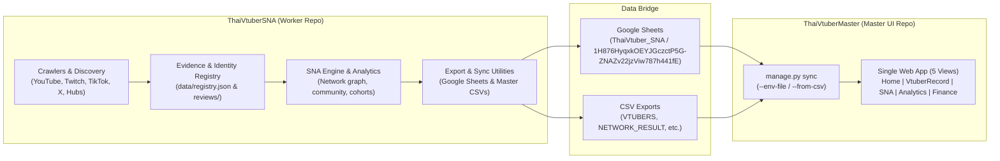

# Thai VTuber Data Worker & Pipeline Engine

> **Status:** Backend Worker & Data Pipeline สำหรับส่งมอบข้อมูลให้กับ **[ThaiVtuberMaster](https://github.com/Icezaza2543/ThaiVtuberMaster)**

คลังโค้ดนี้ทำหน้าที่เป็น **Worker ฝั่งประมวลผลและรวบรวมข้อมูล (Data Ingestion, Crawling & Analytics Engine)** ของโครงการ VTuber ประเทศไทย รับผิดชอบการคลานข้อมูล (Discovery), ตรวจสอบหลักฐานปฐมภูมิ (First-Party Evidence Review), คำนวณเครือข่ายความสัมพันธ์ผู้ติดตาม (SNA & Overlap), และจัดส่งข้อมูลเข้าสู่ Google Sheets (`ThaiVtuber_SNA`) ตลอดจนชุดไฟล์ CSV เพื่อให้เว็บไซต์หลัก [ThaiVtuberMaster](https://github.com/Icezaza2543/ThaiVtuberMaster) นำไปแสดงผล

---

## 1. สถาปัตยกรรมระบบ (Two-Repository Architecture)



- **[ThaiVtuberMaster](https://github.com/Icezaza2543/ThaiVtuberMaster)** (Master UI): เว็บไซต์หน้าบ้าน (Frontend) แสดงผล 5 มุมมองหลัก (Home, VtuberRecord, SNA, Data Analytics, Financial Analytics)
- **ThaiVtuberSNA** (Worker Backend): ตัวประมวลผลหลัก ทำหน้าที่เก็บข้อมูลเชิงลึก, ตรวจสอบตัวตน, คำนวณคณิตศาสตร์เครือข่าย และป้อนข้อมูลเข้าสู่ระบบ

---

## 2. หน้าที่หลักของ Worker (Core Capabilities)

### ก. การค้นหาและคลานข้อมูล (Data Discovery & Crawling)
- ระบบ Harvest & Discovery อัตโนมัติ 24/7 (`scripts/automation/run_discovery_24x7.ps1`)
- ตัวเก็บข้อมูล YouTube Channel About, Twitch API/Web, TikTok Web Embeds, X Profiles และ Hub Aggregators (Linktree, lit.link, Carrd)
- Stage 1-4 Pipeline สำหรับสำรวจและจับคู่ข้ามแพลตฟอร์มอย่างเป็นระบบ (`python -m registry map-creators`)

### ข. สารบบตัวตนและหลักฐานปฐมภูมิ (First-Party Evidence Registry)
- ฐานข้อมูลตัวตนและบัญชีทางการ (`data/registry.json`) รองรับ 10 แพลตฟอร์ม
- การคัดกรองและตรวจสอบผ่าน Candidate Queue (`python -m registry queue`)
- กฎเหล็ก: ยืนยันเฉพาะบุคคลที่มีหลักฐานปฐมภูมิ (Owner cross-link / statement) เท่านั้น ไม่คาดเดาจากความคล้ายคลึงของชื่อ

### ค. การคำนวณเครือข่ายความสัมพันธ์ (SNA & Overlap Analytics)
- คำนวณ Network Result, Shared Audience Overlap, Jaccard Similarity, Bridge Scores
- จัดกลุ่ม Community Detection และวิเคราะห์แนวโน้มการเติบโตเชิงรุ่น (Cohort Analytics)

### ง. การส่งมอบข้อมูลสู่ ThaiVtuberMaster (Export & Sync)
- **Google Sheets Batch Updates**: จัดเตรียมและส่งข้อมูลเข้าสู่ชีต `ThaiVtuber_SNA` (ID: `1H876HyqxkOEYJGczctP5G-ZNAZv22jzViw787h441fE`) ผ่าน `scripts/maintenance/prepare_analytics_sheets.py`
- **Direct Master CSV Export**: สรุปข้อมูลทั้งหมดเป็นชุด CSV พร้อมนำเข้า [ThaiVtuberMaster](https://github.com/Icezaza2543/ThaiVtuberMaster) ได้ทันทีผ่าน `scripts/maintenance/export_to_master.py`

---

## 3. การใช้งานและคำสั่งหลัก (Usage & Operations)

### การเตรียม Environment
ต้องใช้ Python 3.11 ขึ้นไป:
```bash
# ติดตั้ง dependencies สำหรับ discovery (Playwright)
pip install -r requirements.txt
pip install playwright
```

### การตรวจสอบและทดสอบระบบ
```bash
# ตรวจสอบความถูกต้องของฐานข้อมูลสารบบ
python -m registry validate

# รันชุดทดสอบความถูกต้องของตรรกะและระบบทั้งหมด
python -m unittest discover -s tests -v
```

### การจัดการ Candidate และ Review
```bash
# ดูคิวบัญชีที่รอการตรวจสอบ
python -m registry queue --status pending --limit 50

# ตรวจสอบรายละเอียดตัวตนหรือผู้สมัคร
python -m registry inspect persona <PERSONA_ID>
python -m registry inspect candidate <CANDIDATE_ID>

# ทดสอบรันการนำผลการตรวจสอบเข้าสารบบ (Dry Run)
python -m registry apply --file reviews/<CHANGE_FILE>.json --dry-run

# นำผลการตรวจสอบเข้าสารบบจริง
python -m registry apply --file reviews/<CHANGE_FILE>.json
```

### การส่งออกข้อมูลสำหรับ ThaiVtuberMaster
ส่งออกไฟล์ CSV สำหรับ [ThaiVtuberMaster](https://github.com/Icezaza2543/ThaiVtuberMaster) เพื่อนำไปใช้งานแบบ Offline หรือ Sync โดยตรง:
```bash
python scripts/maintenance/export_to_master.py --output ../ThaiVtuberMaster/local/sheet-exports
```

จากนั้นที่ฝั่ง `ThaiVtuberMaster` สามารถสั่ง Sync ได้ทันที:
```bash
python scripts/manage.py sync --from-csv ./local/sheet-exports
```

### การรัน Discovery Loop อัตโนมัติ (Windows)
```powershell
# รันรอบเดียว (One-off bounded cycle)
powershell -ExecutionPolicy Bypass -File scripts/automation/run_discovery_24x7.ps1 -Once

# รันต่อเนื่องแบบ 24/7
powershell -ExecutionPolicy Bypass -File scripts/automation/run_discovery_24x7.ps1
```

---

## 4. หมายเหตุเกี่ยวกับ Legacy Web Frontend

โฟลเดอร์ `web/` ใน repository นี้เป็น Static Interface ต้นแบบสำหรับ Local Preview และตรวจสอบผลการคำนวณอัลกอริทึมกราฟในระหว่างการพัฒนา การเผยแพร่หน้าเว็บหลักสู่สาธารณะทั้งหมดได้รับการโอนย้ายไปบริหารจัดการที่ **[ThaiVtuberMaster](https://github.com/Icezaza2543/ThaiVtuberMaster)** อย่างเป็นทางการแล้ว
