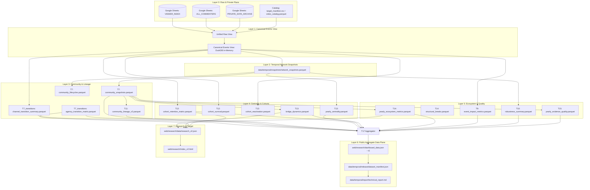

# Current Data Capabilities & Analytical Architecture Audit

> **Target**: ThaiVtuberSNA Repository  
> **Date**: September 9, 2026  
> **Status**: Comprehensive Inventory Sealed (Pre-Refactor Baseline)  
> **Scope**: Tasks T1–T20, Parquet Store, Google Sheets Data Plane, and Research v2 Contracts

---

## 1. Executive Summary

Over successive development sprints, the ThaiVtuberSNA data pipeline evolved from a static one-off network crawler into a multi-phase longitudinal observatory spanning 2020 through 2026 (YTD). The codebase currently produces 29 parquet analytical datasets, extensive markdown verification reports, a 319-test automated test suite, and an interactive 3D WebGL observatory.

However, as the project prepares for **Research v2** (an executive, question-driven industry intelligence platform), significant architectural friction exists:
- **Tight generator-output coupling**: Output directory paths and build orders are hardcoded across `scripts/analysis_dag.py` and `scripts/observatory_controller.py`.
- **Multiple sources of truth**: Channel metadata and target cohorts are duplicated across CSVs, parquet tables, and Google Sheets worksheets.
- **Frontend calculation leakage**: Several metric transformations, delta ratios, and ranking calculations remain in frontend JavaScript rather than canonical backend contracts.
- **Terminology divergence**: Multiple iterations of community lineage and viewer identity models leave legacy or superseded artifacts (`community_lineage.parquet` v1 vs v2).

This document establishes the authoritative pre-refactor inventory, maps the full end-to-end data dependency DAG, and catalogs technical debt items for the upcoming major refactor.

---

## 2. End-to-End Analytical Dependency Map (DAG)

The analytical data flow moves strictly through eight sequential layers:

---

## 3. Inventory of Analytical Artifacts (T1–T20)

| Task ID | Component Name | Primary Output File(s) | Rows | Cols | Status | Source of Truth |
|---|---|---|---|---|---|---|
| **T1** | Target Catalog | `data/temporal/catalog/video_catalog.parquet` | 24,198 | 12 | ACTIVE | YouTube API crawl / channel listings |
| **T1** | Target Manifest | `data/temporal/catalog/target_manifest.csv` | 100 | 8 | ACTIVE | Curated top 100 Thai VTubers |
| **T1** | Channel Coverage | `data/temporal/catalog/channel_coverage.parquet` | 100 | 14 | ACTIVE | Aggregated video counts per channel |
| **T5** | Backfill Manifest | `data/temporal/backfill/sampling_manifest.parquet` | 6,854 | 11 | ACTIVE | Stratified backfill plan |
| **T6** | Deepening Manifest | `data/temporal/deep_backfill/deep_sampling_manifest.parquet` | 512 | 11 | ACTIVE | High-centrality deep sampling plan |
| **T7** | Network Snapshots | `data/temporal/snapshots/network_snapshots.parquet` | 8,642 | 14 | ACTIVE | DuckDB pairwise co-occurrence |
| **T7** | Community Snapshots | `data/temporal/analysis/community_snapshots.parquet` | 468 | 8 | ACTIVE | Louvain community detection per window |
| **T7** | Community Lifecycles| `data/temporal/analysis/community_lifecycles.parquet` | 38 | 9 | ACTIVE | Cluster survival and persistence |
| **T7** | Yearly Network | `data/temporal/analysis/yearly_network_metrics.parquet` | 7 | 15 | ACTIVE | Graph density, modularity, reciprocity |
| **T7_trans** | Audience Transitions | `data/temporal/analysis/channel_transition_summary.parquet` | 2,145 | 9 | ACTIVE | Channel-to-channel audience movement |
| **T7_trans** | Agency Transitions | `data/temporal/analysis/agency_transition_matrix.parquet` | 49 | 6 | ACTIVE | Agency-to-agency movement matrix |
| **T8** | Lineage v1 (Legacy) | `data/temporal/analysis/community_lineage.parquet` | 32 | 8 | **SUPERSEDED** | Replaced by T11 Lineage v2 |
| **T9** | Event Impact | `data/temporal/event_analysis/event_impact_metrics.parquet` | 420 | 12 | ACTIVE | Difference-in-differences around major events |
| **T10** | Robustness Sweep | `data/temporal/robustness/robustness_summary.parquet` | 54 | 10 | ACTIVE | Perturbation & threshold sensitivity |
| **T11** | Lineage v2 | `data/temporal/analysis/community_lineage_v2.parquet` | 42 | 11 | ACTIVE | Bidirectional Hungarian match lineage |
| **T12** | Cohort Retention | `data/temporal/cohorts/cohort_retention_matrix.parquet` | 49 | 7 | ACTIVE | Annual cohort retention tracking |
| **T12** | Cohort Survival | `data/temporal/cohorts/cohort_survival.parquet` | 28 | 6 | ACTIVE | Kaplan-Meier style persistence curves |
| **T12** | Reactivation | `data/temporal/cohorts/cohort_reactivation.parquet` | 21 | 5 | ACTIVE | Returning account fractions after gap years |
| **T13** | Centrality Evolution| `data/temporal/centrality/yearly_centrality.parquet` | 580 | 12 | ACTIVE | PageRank, Betweenness, Degree |
| **T13** | Bridge Dynamics | `data/temporal/centrality/bridge_dynamics.parquet` | 210 | 10 | ACTIVE | Cross-community boundary spanners |
| **T14** | Ecosystem Evolution| `data/temporal/ecosystem/yearly_ecosystem_metrics.parquet` | 7 | 22 | ACTIVE | Macro supply, entropy, Gini, growth |
| **T14** | Structural Breaks | `data/temporal/ecosystem/structural_breaks.parquet` | 14 | 8 | ACTIVE | Chow test / Bayesian break detection |
| **T15** | Evidence Quality | `data/temporal/quality/yearly_evidence_quality.parquet` | 7 | 14 | ACTIVE | Missingness, bias indices, coverage |
| **T16** | Observatory State | `data/temporal/observatory/observatory_state.json` | — | — | ACTIVE | Production scheduler ledger |
| **T17** | Dashboard Export | `web/research/dashboard_data.json` | — | — | ACTIVE | Monolithic JSON bundle for Research v1 |
| **T18** | Release Manifest | `data/temporal/release/dataset_manifest.json` | — | — | ACTIVE | SHA-256 hashes and row counts |
| **T19** | Technical Report | `data/temporal/report/technical_report.md` | — | — | ACTIVE | Auto-generated academic report |
| **T20** | Controller Check | `scripts/observatory_controller.py` | — | — | ACTIVE | Autonomous DAG pipeline runner |

---

## 4. Key Architectural Flaws & Technical Debt

### 4.1 Duplicate Metrics & Split Naming
1. **Network Modularity**:
   - Stored as `modularity` in `yearly_network_metrics.parquet`.
   - Stored as `louvain_modularity` in `yearly_ecosystem_metrics.parquet`.
   - Stored as `modularity_q` in `dashboard_data.json`.
   *Action for refactor*: Standardize on `modularity_q` across all tables.
2. **Active Creator Count**:
   - In `channel_coverage.parquet`, `active_channels` indicates any channel with $\ge 1$ video cataloged ($N=100$).
   - In `yearly_ecosystem_metrics.parquet`, `active_creators` indicates channels with $\ge 1$ observed interaction event in that annual window (e.g. 96 in 2024, 78 in 2026 YTD).
   *Action for refactor*: Name explicitly: `cataloged_creators` vs `interaction_active_creators`.

### 4.2 Stale Terminology & Superseded Artifacts
1. **Lineage v1 vs v2**:
   - `data/temporal/analysis/community_lineage.parquet` (v1) remains on disk despite being completely replaced by `community_lineage_v2.parquet` in T11.
   *Action for refactor*: Deprecate v1 artifact; route all consumer scripts to v2.
2. **Viewer Candidate Index Semantics**:
   - Older generator docstrings referred to "Reconciled Viewers" before the data dictionary sealed the authoritative term **"Master Identity Candidate Index (Pending Cross-Namespace Reconciliation)"**.
   *Action for refactor*: Ensure all docstrings and internal log messages use the sealed dictionary terminology.

### 4.3 Redundant Sources of Truth
1. **Target Channel Registry**:
   - `data/temporal/catalog/target_manifest.csv` (100 rows).
   - `data/thai_vtuber_registry.csv` (1,500+ rows).
   - `data/registry_vtubers.csv` (1,500 rows).
   - Google Sheets `VTUBERS` tab (1,500 rows).
   - In-memory dictionaries in `scripts/build_historical_lifecycle.py`.
   *Action for refactor*: Establish a single unified `storage/catalog_store.py` that reads from the canonical registry and caches a validated target manifest.

### 4.4 Calculations Performed in Frontend
1. **Dashboard v1 (`web/research/research_dashboard.js`)**:
   - Client-side min/max normalization of centrality scores.
   - Client-side YoY percentage delta calculations.
   - Client-side color assignment for communities.
2. **Observatory (`web/app.js`)**:
   - Hardcoded `AGENCY_ISLAND_COORDINATES` dictionary.
   *Action for refactor*: Research v2 must consume pre-calculated, ready-to-render data from `web/research/data/research_v2.json`.

### 4.5 Generator / Output Tight Coupling
1. In `scripts/analysis_dag.py`, the DAG defines hardcoded string tuples for modules and functions.
2. If any output file is moved or renamed, the entire release validation suite (`validate_dataset_release.py`) fails because it validates a rigid static manifest schema.
   *Action for refactor*: Implement a declarative pipeline orchestrator with explicit typed data contracts.

---

## 5. Transition Path to Research v2

Research v2 requires moving from the exploratory graph viewer of Research v1 into a **decision-support platform** answering 9 explicit executive questions.

The following new data pipelines are required to feed Research v2 without violating project invariants:
1. **Creator Ecosystem Expansion (N2)**: A normalized public ledger of verified lifecycle events (`data/industry/creator_status_events.parquet`).
2. **Collab Event Foundation (N3–N4)**: An explicit registry of verified collaborative streams (`data/industry/collab_events.parquet`) with observational before/after metrics.
3. **Audience Behavior Aggregates (N5)**: Safe k-anonymized public aggregates (`data/industry/audience_behavior_yearly.parquet`) derived from private data plane records.
4. **Market & Monetization Evidence (N6–N8)**: A verified public signal registry (`data/market/market_evidence.parquet`) with explicit non-summing rules and addressable market context.
5. **Ecosystem Outlook Model (N9)**: Multi-dimensional scorecard classifying structural trajectory into empirical states (`data/industry/outlook_indicators.parquet`).
6. **Unified Research v2 Contract (N10)**: A clean, public aggregate JSON file (`web/research/data/research_v2.json`) directly consumed by `web/research/index_v2.html`.
