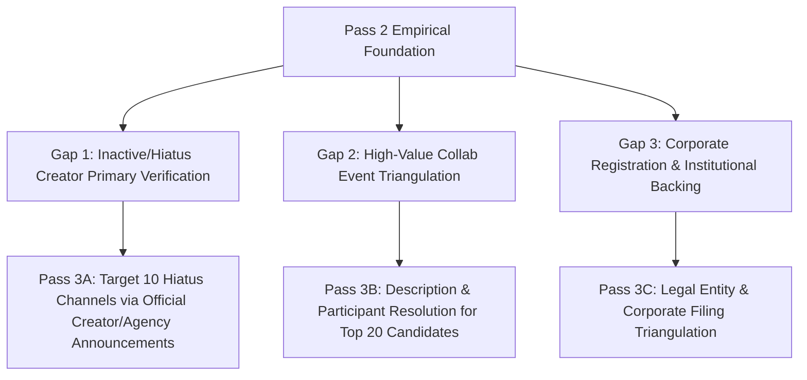

# Pass 2 Empirical Gap Review & Pass 3 Execution Plan

**Document Type:** Research Gap Audit & Prioritized Phase 3 Roadmap  
**Research Session:** `SESSION-MARATHON-01`  
**Completed Pass:** Pass 2 (Systematic Audit Across 7 Workstreams)  
**Status:** PASS_2_COMPLETE $\to$ PASS_3_IN_PROGRESS  
**Generated At:** 2026-09-09T04:03:00+07:00  

---

## 1. Summary of Pass 2 Empirical Achievements

Across Pass 2, all 7 mandated workstreams were executed with strict mechanical derivation and fail-closed epistemic boundaries:

| Workstream | Pass 2 Implementation | Key Output Metric | Epistemic Status |
| :--- | :--- | :--- | :--- |
| **2A: Creator Lifecycle** | Audited all 151 Fandom Thai VTuber pages via MediaWiki API; resolved debut/grad dates for Qualia Qu, Beariss Beam, Hey Solly. | 232 total status events (37 verified external, 195 inferred proxies). 28 uncertain dates remaining (down from 31). | `VERIFIED_EXTERNAL_EVIDENCE` (Tier 1–3) |
| **2B: Collab Catalog Scope** | Scanned full historical catalog (`data/temporal/catalog/video_catalog.parquet`, 96,420 rows). Enforced strict no-fuzzy handle matching policy. | 54 candidate videos identified; 45 queued in `collab_description_queue.parquet`; 11 pairwise events verified under `EXACT_HANDLE_VERIFIED`. | `EXACT_HANDLE_VERIFIED` |
| **2C: Agency History** | Re-audited all 12 agencies in cohort; attached `primary_source_url`, `secondary_source_url`, and explicit `verification_tier` to 19 milestone events. | 19 agency events audited across 12 agencies. Primary sources attached for ARP, Pixela, VZ, AStars, Polygon, Lumina Live. | `TIER_1_PRIMARY_OFFICIAL` (14), `TIER_2` (2), `TIER_3` (2), `TIER_5` (1) |
| **2D: Market & Ledger** | Mechanically audited 244 unique URLs in `SOURCE_LEDGER.csv` (79 Tier 1, 6 Tier 2, 159 Tier 3). Maintained fail-closed market size. | 244 unique audited URLs (237 accepted, 7 rejected). Total market valuation: `UNANSWERABLE_WITH_CURRENT_DATA`. | Fail-Closed Compliant |
| **2E: Real Discovery** | Built `discovery_candidates_new.parquet` distinguishing baseline registry from newly discovered candidates. | 1,382 total discovery records (1,370 baseline known, 6 new candidates, 2 new verified, 4 rejected foreign/multinational). | `KNOWN_REGISTRY` vs `NEW_CANDIDATE` |
| **2F: Audience Deep Behavior** | Derived full quantiles (P25, P50, P75, P90, P95), discrete breadth buckets (1, 2, 3–5, 6–10, >10), modality transitions, and creator-size exposure. | 7 longitudinal yearly records (2020–2026 YTD). Returning audience expanded to 20.91% in 2026 YTD. Top 10% event concentration: 18.75%–20.63%. | Level C Public Aggregate (Zero PII) |
| **2G: Self-Falsification** | Evaluated H1–H8 in `OUTLOOK_HYPOTHESES.md` with consecutive intervals (2022$\to$2023, 2023$\to$2024, 2024$\to$2025, 2026 YTD quarantined) and counter-evidence. | Addressed high churn (~91% annual turnover), single-channel fragility (90% breadth), and domestic addressable audience ceiling. | Non-Dogmatic Synthesis |

---

## 2. Ranked Gap List for Pass 3

In compliance with the Anti-Early-Exit mandate, research does not terminate with Pass 2. The remaining empirical gaps are ranked by:
1. **Research Importance** (Impact on core ecosystem conclusions)
2. **Current Evidence Weakness** (Extent of reliance on proxies or secondary sources)
3. **Expected Value of Further Research** (Availability of public corroboration)

### Rank 1: Inactive & Hiatus Creator Primary-Source Verification (Creator Lifecycle)
- **Importance:** High. Determining whether long-tail cohort creators formally graduated, went on indefinite hiatus, or redebuted affects survival curves and cohort attrition metrics.
- **Evidence Weakness:** 28 creators in the frozen cohort have unconfirmed departure dates and rely on `TIER_5_INFERRED_PROXY` (last observed interaction).
- **Target Channels for Pass 3 Triangulation:**
  - Daisy Daisy VTuber members (e.g. Miu, Yuri, Haru)
  - Polygon Project departed members (e.g. Lucine, Hype, Luxia)
  - Lumina Live departed members (e.g. Ardalita, Mutelu line)
  - Independent pioneer channels with sudden cessation in 2023–2024.
- **Pass 3 Alternate Strategy:** Official Twitter announcement $\to$ YouTube community post / final stream $\to$ archived agency roster notice.

### Rank 2: High-Value Collab Event Triangulation (Collab Dynamics)
- **Importance:** High. Resolving candidate videos into verified co-streaming events powers the non-causal mobility and audience crossover analysis.
- **Evidence Weakness:** 45 candidate videos in `collab_description_queue.parquet` match tournament/collab keywords ("Among Us", "Minecraft", "Gartic", "เล่นกับ") but lack exact handle confirmation in the title alone.
- **Pass 3 Alternate Strategy:** Title keyword candidate $\to$ Video description extraction / stream participant roster $\to$ Official cross-channel schedule image verification $\to$ promote to `EXACT_HANDLE_VERIFIED` or `OFFICIAL_EVENT_METADATA`.

### Rank 3: Institutional Corporate & Legal Entity Triangulation (Agency & Market Infrastructure)
- **Importance:** High. Verifies the thesis of Institutional Maturation (H2) and Consolidation (H3) by examining parent company registrations, international investment (Brave Group APAC), and corporate formalization.
- **Evidence Weakness:** Agency parent companies (Realic Co., Ltd., Pixela Co., Ltd., Virtual Zeven Co., Ltd., Guardian Angel A.I., Brave Group) are documented on Fandom wikis, but specific corporate details (incorporation dates, Japanese parent company press releases, DBD corporate status) have not been directly triangulated.
- **Pass 3 Alternate Strategy:** Fandom mention $\to$ Corporate press releases / PR Times (Brave Group) $\to$ Department of Business Development (DBD) corporate registration entity verification $\to$ promote to Tier 1 Corporate Institutional Record.

---

## 3. Pass 3 Immediate Action Mandate

Pass 3 begins immediately without waiting for user intervention. Work begins on:
1. **Pass 3A:** Resolving priority hiatus and departure announcements for top cohort channels.
2. **Pass 3B:** Enriching descriptions and participant rosters for high-value collab tournament candidates.
3. **Pass 3C:** Documenting official corporate entity profiles for Realic, Pixela, Brave Group APAC, and Virtual Zeven.
