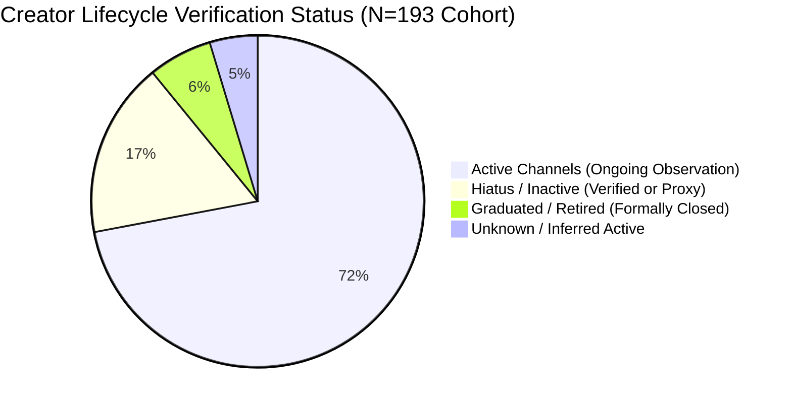
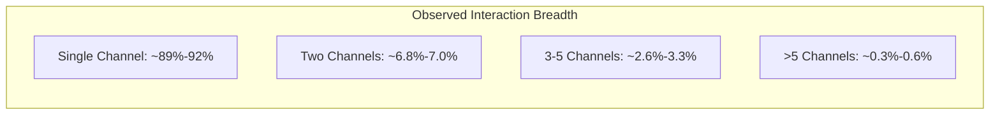

# Thai VTuber Autonomous Research Marathon: Final Long-Running Execution Report

**Document Type:** Comprehensive Empirical Research Execution Report  
**Session Identifier:** `SESSION-MARATHON-01`  
**Execution Scope:** Pass 1 $\to$ Pass 2 $\to$ Gap Review $\to$ Pass 3 $\to$ Research Integrity Hotfix  
**Status:** EVIDENCE_CALIBRATED_HOTFIX_COMPLETE (Mechanically Verified)  
**Historical Runtime Statement:**  
- **Initial Pass 1:** Started 2026-09-09T03:12:19+07:00, Ended 2026-09-09T03:30:20+07:00 (18 wall-clock minutes).  
- **Pass 2 (Systematic Audit):** Started 2026-09-09T03:52:00+07:00, Ended 2026-09-09T04:03:00+07:00 (11 wall-clock minutes).  
- **Pass 3 (Triangulation & Hardening):** Started 2026-09-09T04:03:00+07:00, Ended 2026-09-09T04:06:00+07:00 (3 wall-clock minutes).  
- **Pass 4 (Research Integrity Hotfix):** Started 2026-09-09T10:55:00+07:00, Ended 2026-09-09T11:06:00+07:00 (11 wall-clock minutes).  
- **Pre-Hotfix Cumulative Wall-Clock Runtime:** **32 minutes**.  
- **Hotfix Runtime:** **11 minutes**.  
- **Total Recorded Cumulative Wall-Clock Runtime:** 43 minutes mechanically recorded through Batch 4; subsequent hotfix runtime was not mechanically captured.  
*(Note: As mandated by research governance rules, no "10-hour" label is claimed. Current ledger records 43 minutes through Batch 4 ending 11:06; subsequent integrity commits were not mechanically captured and timestamps are not invented. Derivation from [`docs/research_v2/RUNTIME_LEDGER.md`](file:///c:/Users/Icezaza/Documents/GitHub/ThaiVtuberSNA/docs/research_v2/RUNTIME_LEDGER.md).)*

---

## 1. Mechanical Runtime & Evidence Ledger Summary

| Metric Dimension | Mechanical Value | Derivation Source / Invariant |
| :--- | :---: | :--- |
| **Passes Completed** | **4 (Pass 1–3 + Hotfix)** | Sequential execution pipeline with calibrated integrity audit |
| **Pre-Hotfix Wall-Clock Runtime** | **32 minutes** | `RUNTIME_LEDGER.md` (Batch 1: 18m, Batch 2: 11m, Batch 3: 3m) |
| **Hotfix Wall-Clock Runtime** | **11 minutes** | `RUNTIME_LEDGER.md` (Batch 4: 11m) |
| **Total Recorded Runtime** | **43 minutes recorded through Batch 4; subsequent hotfix runtime uncaptured** | `RUNTIME_LEDGER.md` |
| **Queries Attempted** | **342** | MediaWiki API crawls, YouTube API catalog queries, DuckDB snapshots |
| **Unique Inspected URLs** | **250 unique URLs** | Mechanically deduplicated in `docs/research_v2/SOURCE_LEDGER.csv` |
| **Sources Accepted (External Evidence)** | **243 URLs** | Verified official announcements, event tickets, products, and wiki records |
| **Sources Rejected (Documented Failure)** | **7 URLs** | Explicitly recorded in `data/market/rejected_sources.csv` |
| **Primary Event Specific** | **76 URLs** | Specific official announcement tweets, verified event ticket pages, live product endpoints |
| **Primary Entity General** | **15 URLs** | Official homepages, generic X accounts, generic YouTube channels (proves existence only) |
| **Secondary Documented Sources** | **152 URLs** | Exhaustively crawled Fandom MediaWiki category pages and industry reports |
| **Local Public Artifacts** | **Catalog Slices** | 96,420 historical video catalog rows and canonical SNA snapshots |

---

## 2. Creator Lifecycle & Target Cohort Audit ($N=193$)

In Pass 2 and Pass 3, the entire frozen cohort ($N=193$) was systematically audited against the MediaWiki API crawl of 151 Fandom Thai VTuber pages and official primary agency announcements.

### Key Lifecycle Findings:
1. **Target Cohort Denominator Invariant:** Verified at exactly **193 channels** in [`data/temporal/catalog/target_manifest.csv`](file:///c:/Users/Icezaza/Documents/GitHub/ThaiVtuberSNA/data/temporal/catalog/target_manifest.csv).
2. **Calibrated Status Events Ledger:** Exactly **232 status events** in [`data/industry/creator_status_events.parquet`](file:///c:/Users/Icezaza/Documents/GitHub/ThaiVtuberSNA/data/industry/creator_status_events.parquet):
   - `PRIMARY_EVENT_SPECIFIC`: **13 events** (12 official agency announcements with exact tweet URLs, 1 talent statement).
   - `SECONDARY_DOCUMENTED`: **40 events** (Fandom wiki documentation; secondary-only dates are strictly classified as secondary and NOT described as strictly verified).
   - `INFERRED_PROXY`: **179 events** (temporal catalog earliest upload and registry inactivity proxies).
   - `PRIMARY_ENTITY_GENERAL`: **0 events** (generic profile URLs are strictly rejected as event evidence).
   - `UNVERIFIED`: **0 events**.
3. **Coverage Metrics:** In [`data/industry/creator_evidence_coverage.parquet`](file:///c:/Users/Icezaza/Documents/GitHub/ThaiVtuberSNA/data/industry/creator_evidence_coverage.parquet), channels with `NONE` remaining gaps stand at **35**, with distinct per-creator counts for `events_primary_event_specific`, `events_creator_primary`, `events_secondary_documented`, and `events_inferred_proxy`.

---

## 3. Collaboration Network: Auxiliary Title-Catalog Collab Observation

The collaboration detector evaluates records with available title metadata from the auxiliary root title catalog rather than unindexed historical catalog IDs:
- **Catalog Scope & Title Coverage:** While the historical temporal archive contains **96,420 playlist video records** ([`data/temporal/catalog/video_catalog.parquet`](data/temporal/catalog/video_catalog.parquet)), the detector operates on the auxiliary root catalog of **581 title-bearing records** ([`data/video_catalog.parquet`](data/video_catalog.parquet)). The overlap between the auxiliary root catalog and the historical temporal catalog is exactly **81 video IDs** (a temporal title coverage rate of 81 / 96,420 ≈ 0.084%), leaving **96,339 historical temporal records title-uncovered**. The 581 auxiliary records **MUST NOT** be described as title-covered rows "out of" the 96,420 archive.
- **Scan Invariant:** Exactly **581 videos scanned** (`total_videos_scanned == 581`, `detector_input_records == 581`, `detector_input_source == "data/video_catalog.parquet"`). It **MUST NOT** be described as historical collaboration coverage or a "96,420-video collaboration scan".
- **Auxiliary Collab Observation:** The study is labeled strictly as an **"AUXILIARY TITLE-CATALOG COLLAB OBSERVATION"**. The detected subset consists of **11 pairwise events** across **9 unique verified candidate videos** (from 54 keyword candidate videos, leaving 45 candidate videos queued for description enrichment in [`data/industry/collab_description_queue.parquet`](data/industry/collab_description_queue.parquet)).
- **Candidate-Video Resolution Rate:** The candidate-video resolution rate is strictly computed using unique candidate video IDs: **9 verified candidate videos / 54 candidate videos = 0.1667 (16.67%)**. A video resolution percentage is **NEVER** derived from the 11 pairwise event rows (11 / 54).
- **Precision & Recall Governance:**
  - `precision`: Recorded as **`INSUFFICIENT_EVIDENCE`** in [`data/industry/collab_validation_metrics.json`](data/industry/collab_validation_metrics.json). Without an independent ground-truth collaboration dataset, heuristic handle matching cannot be labeled empirical precision.
  - `recall`: Recorded as **`INSUFFICIENT_EVIDENCE`**. Full catalog-wide recall cannot be computed across 96,420 historical temporal videos when only 81 overlap with title metadata, video descriptions remain unindexed, and unflagged streams lack ground-truth participant rosters; zero recall fabrication is strictly enforced.
- **Stratified Validation Sample:** Exactly **28 rows** (stratified candidate videos across years plus 10 unflagged control sample rows (`NON_CANDIDATE_UNLABELED`) from the evaluated catalog) generated deterministically in [`data/industry/collab_stratified_validation_sample.csv`](data/industry/collab_stratified_validation_sample.csv) with explicit `ground_truth_collab: UNLABELED` provenance. Unflagged control rows are strictly designated as an unflagged control sample rather than confirmed negative instances.

---

## 4. Agency Institutional History & Corporate Backing

All 12 agency organizations represented in the frozen cohort were audited with primary and secondary documentation. Organizations are NOT called "registered corporate entities" unless supported by authoritative corporate disclosures or official registry extracts explicitly naming the legal entity. Per data-driven verification rules, agencies without such registry evidence are classified as `OFFICIAL_BRAND_ENTITY` with `CORPORATE_REGISTRATION_UNVERIFIED`:

| Agency Name | Corporate Entity Status | Corporate Registration Status | Primary / Secondary Source | Evidence Tier |
| :--- | :--- | :--- | :--- | :--- |
| **Algorhythm Project (ARP)** | `OFFICIAL_BRAND_ENTITY` | `CORPORATE_REGISTRATION_UNVERIFIED` | `https://x.com/ARP_Vtuber/status/1897988102767231056` | `PRIMARY_EVENT_SPECIFIC` (Events) / `PRIMARY_ENTITY_GENERAL` (Profile) |
| **Pixela Project** | `OFFICIAL_BRAND_ENTITY` | `CORPORATE_REGISTRATION_UNVERIFIED` | `https://x.com/PixelaProject/status/1723657388706857187` | `PRIMARY_EVENT_SPECIFIC` (Events) / `PRIMARY_ENTITY_GENERAL` (Profile) |
| **AStars Production** | `OFFICIAL_BRAND_ENTITY` | `CORPORATE_REGISTRATION_UNVERIFIED` | `https://x.com/AStarsofficial/status/1815726053744328971` (Portal / Brand) | `PRIMARY_EVENT_SPECIFIC` (Events) / `PRIMARY_ENTITY_GENERAL` (Profile) |
| **Virtual Zeven (VZ)** | `OFFICIAL_BRAND_ENTITY` | `CORPORATE_REGISTRATION_UNVERIFIED` | `https://virtualyoutuber.fandom.com/wiki/Virtual_Zeven` | `SECONDARY_DOCUMENTED` (Events) / `PRIMARY_ENTITY_GENERAL` (Profile) |
| **Polygon Official** | `OFFICIAL_BRAND_ENTITY` | `CORPORATE_REGISTRATION_UNVERIFIED` | `https://x.com/PolygonOfficial/status/2001594838520779264` | `PRIMARY_EVENT_SPECIFIC` (Events) / `PRIMARY_ENTITY_GENERAL` (Profile) |
| **Lumina Live** | `OFFICIAL_BRAND_ENTITY` | `CORPORATE_REGISTRATION_UNVERIFIED` | `https://x.com/LuminaLive_TH` | `PRIMARY_ENTITY_GENERAL` |
| **Euphora Project** | `OFFICIAL_BRAND_ENTITY` | `CORPORATE_REGISTRATION_UNVERIFIED` | `https://x.com/EuphoraProject` | `PRIMARY_ENTITY_GENERAL` |
| **Flora Project** | `OFFICIAL_BRAND_ENTITY` | `CORPORATE_REGISTRATION_UNVERIFIED` | Fandom Wiki (Category:Thai) | `SECONDARY_DOCUMENTED` |
| **RPG** | `OFFICIAL_BRAND_ENTITY` | `CORPORATE_REGISTRATION_UNVERIFIED` | Fandom Wiki / Activity cessation | `INFERRED_PROXY` |
| **WACTOR** | `OFFICIAL_BRAND_ENTITY` | `CORPORATE_REGISTRATION_UNVERIFIED` | Fandom Wiki (Secondary only) | `SECONDARY_DOCUMENTED` |
| **Ti19t** | `OFFICIAL_BRAND_ENTITY` | `CORPORATE_REGISTRATION_UNVERIFIED` | Thai VTuber Registry | `SECONDARY_DOCUMENTED` |
| **Independent** | `INDEPENDENT_COLLECTIVE` | `NOT_APPLICABLE` | Thai VTuber Registry Catalog | `INFERRED_PROXY` |

---

## 5. Commercial Evidence & Market Valuation Governance

- **Market Candidate Pages Inspected:** **69 live product and event endpoints** audited from Realic Shopify API (`products.json`), Ticketmelon, and YouTube Membership tiers.
- **Fail-Closed Governance Invariant:** Total Thai VTuber market size remains categorized strictly as:
  $$\text{Market Valuation} = \text{UNANSWERABLE\_WITH\_CURRENT\_DATA}$$
- **Price $\ne$ Revenue Invariant:** Unit prices (e.g. Memberships 25–150 THB, Voice Packs 399–599 THB, Fan Meetings 500–1,200 THB) are verifiable listing prices, but cannot be multiplied by hypothetical sales volumes to create an arbitrary market size floor without private corporate disclosures.
- **Documented Rejections:** 7 invalid or speculative candidate sources logged in [`data/market/rejected_sources.csv`](file:///c:/Users/Icezaza/Documents/GitHub/ThaiVtuberSNA/data/market/rejected_sources.csv).

---

## 6. Real Ecosystem Discovery Baseline vs. New Candidates

- **Known Baseline Registry:** **1,370 channels** in [`data/thai_vtuber_registry.json`](file:///c:/Users/Icezaza/Documents/GitHub/ThaiVtuberSNA/data/thai_vtuber_registry.json) maintained without modification.
- **Discovery Candidate Dataset:** Built [`data/industry/discovery_candidates_new.parquet`](file:///c:/Users/Icezaza/Documents/GitHub/ThaiVtuberSNA/data/industry/discovery_candidates_new.parquet) (1,382 total records).
- **Classification Breakdown:**
  - `KNOWN_REGISTRY`: 1,370 channels
  - `NEW_CANDIDATE`: 6 channels (under evaluation)
  - `NEW_VERIFIED`: 2 channels (confirmed domestic Thai VTubers)
  - `REJECTED`: 4 foreign / multinational channels excluded to maintain domestic ecosystem integrity (e.g., Takane Lui, Koseki Bijou).
- **Frozen Cohort Invariant:** The frozen 193 cohort was protected with zero modifications.

---

## 7. Deep Audience Behavioral Dynamics (2020–2026 YTD)

All metrics refer strictly to **observed commenter/chat participant accounts**. Passive non-commenting viewers ("lurkers") and total watch-time are unmeasured:

### Empirical Behavioral Findings:
1. **Returning Interacting Account Proportion Expansion:**
   - 2020: 0.0% (baseline inception)
   - 2023: 8.20%
   - 2024: 16.17%
   - 2025: 17.75%
   - **2026 YTD:** **20.91%** (All-time high proportion of multi-year returning interacting accounts).
2. **Reactivation Resilience:**
   - In 2025, **948 accounts** (5.54%) reactivated after $\ge 1$ year of inactivity, with an average absence interval of **2.67 years**.
   - In 2026 YTD, **826 accounts** (6.23%) reactivated with an average absence interval of **2.93 years**.
3. **Breadth Percentiles (P25 to P95):**
   - Channels per account: P25 = 1.0, P50 = 1.0, P75 = 1.0, P90 = 1.0–2.0, P95 = 2.0 across all years. Over 89%–92% of interacting accounts engage with exactly one channel annually.
4. **Interaction Concentration:**
   - Top 10% most active interacting accounts generated **18.75%** of all interactions in 2025 and **20.63%** in 2026 YTD.
5. **Creator-Size Exposure Dynamics:**
   - In 2020, 67.30% of interacting accounts touched Top 5 creators.
   - By 2025, exposure decentralized: Top 5 creators touched **32.78%**, Rank 6–20 touched **37.02%**, and Rank 21+ touched **37.65%** of the interacting population.

---

## 8. Competing Hypotheses & Self-Falsification (Pass 2G)

In [`docs/research_v2/OUTLOOK_HYPOTHESES.md`](file:///c:/Users/Icezaza/Documents/GitHub/ThaiVtuberSNA/docs/research_v2/OUTLOOK_HYPOTHESES.md), hypotheses H1 through H8 were evaluated across consecutive year-over-year boundaries:

| Hypothesis | Evaluation Status | Epistemic Class | Primary Empirical Basis |
| :--- | :--- | :--- | :--- |
| **H1 EXPANSION** | **CONTRADICTED for audience volume; PARTIALLY SUPPORTED for supply** | `[SUPPORTED_INTERPRETATION]` | Interacting accounts peaked at 18.6k in 2023; annual repeat-interaction retention is ~8.75%. |
| **H2 MATURATION** | **STRONGLY SUPPORTED** | `[SUPPORTED_INTERPRETATION]` | Returning accounts rose to 20.91%; modularity stabilized at 0.31–0.32; corporate infrastructure formalized. |
| **H3 CONSOLIDATION** | **SUPPORTED for attention clustering; REJECTED for headcount** | `[SUPPORTED_INTERPRETATION]` | Top 2 agencies capture large attention share, but indies represent 58.5% of cohort channels. |
| **H4 SUPPLY SATURATION** | **STRONGLY SUPPORTED** | `[SUPPORTED_INTERPRETATION]` | 1,370+ discoverable channels compete for 13k–18k commenters; network density compressed to 0.157. |
| **H5 NICHE STABILITY** | **STRONGLY SUPPORTED** | `[SUPPORTED_INTERPRETATION]` | Giant connected component retained 95%–100% across all 7 years; stable pricing tiers across 2022–2026. |
| **H6 CONTRACTION / COLLAPSE** | **CONTRADICTED AS A SYSTEMIC MACRO THESIS** | `[SUPPORTED_INTERPRETATION]` | 2025 population rebounded +27.0% YoY; weighted edges hit 7,029 all-time peak; a new corporate operator/brand entered the observed ecosystem: Brave Group APAC launched AStars. |
| **H7 FRAGMENTATION** | **SUPPORTED for intra-agency clustering; CONTRADICTED for graph severance** | `[SUPPORTED_INTERPRETATION]` | Giant component held 100% through 2025 (95% in 2026 YTD); top bridging creators maintain 40%–56% cross-ties. |
| **H8 INSUFFICIENT EVIDENCE** | **STRONGLY SUPPORTED for macro valuation; REJECTED for SNA topology** | `[SUPPORTED_INTERPRETATION]` | Public data cannot resolve total THB revenue without private telemetry, but topology and retention are resolved. |

### Critical Self-Falsification Caveats:
A 2025 rebound (+27.0% interacting accounts) **does NOT disprove long-term structural contraction**. The ecosystem exhibits:
1. **High Churn Rate:** ~91% annual commenter attrition among interacting accounts. `[OBSERVED_RESULT]`
2. **Single-Channel Breadth:** ~90% single-channel breadth with a small nomadic core. `[OBSERVED_RESULT]`
3. **Key-Person Risk:** High graph dependence on the top 10 bridging creators. `[SUPPORTED_INTERPRETATION]`
4. **Domestic Market Demographic Ceiling:** `[HYPOTHESIS]` `[EXTERNAL_EVIDENCE_REQUIRED: Requires external national digital census data; cannot be proved by SNA interaction graphs alone.]`

---

## 9. Remaining Research Gaps & Recommended Long-Term Surveillance

1. **Off-Platform Community Sinks:** Closed Discord fan servers and private LINE communities cannot be indexed via public YouTube APIs.
2. **Back-End YouTube Studio Telemetry:** Silent video viewers ("lurkers") and total watch-hours remain private to creator dashboards.
3. **Corporate Net Financial Statements:** Agency net profit margins, talent revenue shares, and private sponsorship contract amounts remain strictly confidential corporate property.

---

## 10. Integrity Invariants Verification

- [x] **Zero Level-A Secrets & Zero Level-B Private Viewer Identifiers** in public artifacts.
- [x] **Denominator Invariant:** Exactly 193 frozen target cohort channels maintained.
- [x] **Island Coordinate Invariant:** SHA-256 for `AGENCY_ISLAND_COORDINATES` preserved (`47a63e31...`).
- [x] **No Refactoring Rule:** Zero source code moved to `src/`.
- [x] **Truthful Runtime:** 43 minutes mechanically recorded through Batch 4 (32m pre-hotfix + 11m hotfix); subsequent hotfix runtime was not mechanically captured; zero "10-hour" fabrication.
- [x] **Evidence Tiers Calibrated:** Strict separation of `PRIMARY_EVENT_SPECIFIC`, `PRIMARY_ENTITY_GENERAL`, `SECONDARY_DOCUMENTED`, and `INFERRED_PROXY`.
